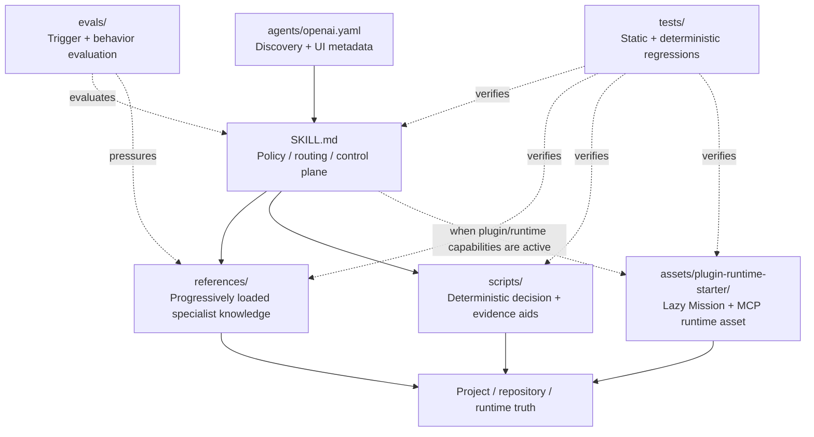
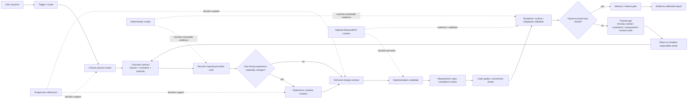
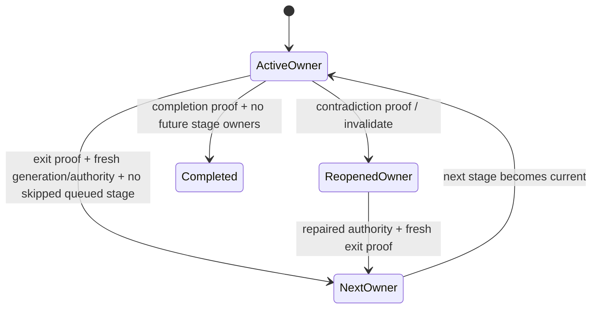
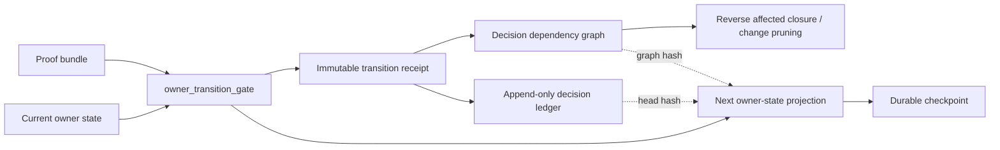
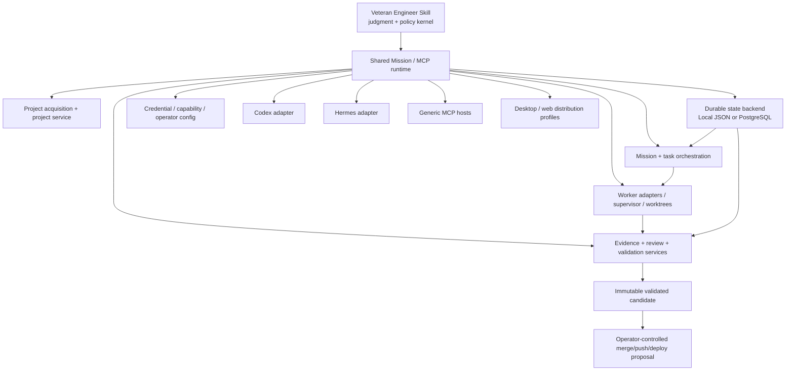

# Veteran Engineer architecture map

This file is a maintainer map of the Skill package. It is descriptive, not a second source of workflow truth. If this map disagrees with the current `SKILL.md`, executable scripts, tests, or runtime package, repair this map instead of using it to override current authority.

Use it before material Skill evolution to decide **which layer owns a change** and to avoid solving routing, domain knowledge, deterministic validation, and runtime orchestration in the same file.

## Contents

1. Package topology
2. Runtime execution graph
3. Knowledge topology
4. Optional Mission/MCP runtime
5. Mutation ownership
6. Maintenance invariants

## 1. Package topology

Layer intent:

- `agents/openai.yaml` controls product discovery metadata and implicit invocation policy. It must not contain engineering workflow logic.
- `SKILL.md` is the compact cross-project control plane. It owns process precedence, stage interfaces, authority ordering, execution loop, primary modes, progressive routing, autonomy boundaries, and completion language.
- `scripts/engineering_context_router.py` has no always-on deep reference set: `CORE` is intentionally empty. Cross-project invariants stay in `SKILL.md`; control/orchestration references consume context only when explicit signals require them.
- `references/` owns deep mechanism knowledge that should load only when the current decision needs it.
- `scripts/` owns deterministic calculators/checkers/navigation aids where machine execution is more reliable than prose reasoning, including capability/evidence-envelope validation.
- `assets/plugin-runtime-starter/` is the lazily packaged optional executable companion: durable mission/task state, MCP tools, worker orchestration, evidence services, host adapters, validation providers, and installation/runtime lifecycle. In this source repository, keep the root runtime authoritative and synchronize the expanded `assets/plugin-runtime-starter/` mirror through repository-native runtime mirror tooling.
- `evals/` and `tests/` are maintenance/evidence surfaces. They test the Skill; they do not become runtime workflow owners.

## 2. Runtime execution graph

The Skill should behave as one connected engineering pipeline, not separate design, coding, QA, and release tracks.

Every material handoff carries a small interface rather than a prose dump:

`artifact/revision identity -> acceptance rows/invariants -> active owner -> open decision frontier -> required evidence`

A downstream stage validates that interface before acting. If it is stale or incomplete, route back to the owner of the missing decision instead of letting the downstream stage invent semantics.

For long or multi-owner work, owner lifecycle is explicit rather than conversational:

`scripts/owner_transition_gate.py` owns the deterministic metadata transition check. It binds `generation + current owner + authority identity + current decision-ledger head`, composes with `scripts/proof_bundle_gate.py`, blocks skipped intermediate stage owners, separates future owners from closed upstream owners, and refuses normal backward handoffs. When decision provenance exists, it delegates affected-set calculation to `scripts/decision_dependency_graph.py`: semantic dependency edges propagate invalidation through the reverse affected closure, observational links do not, and proof-backed preservation nodes act as change-pruning barriers. `scripts/decision_revalidation_plan.py` turns that graph into an incremental work plan: stale roots are recomputed, semantic dependents are revalidated in dependency waves, unrelated nodes are reused, and an equivalent replacement semantic hash prunes downstream work mechanically. `scripts/decision_revalidation_mission.py` may scaffold those dependency waves into mission tasks, but it refuses execution readiness until every task has repository-derived write scope, risk, and validation oracle; the compiled graph is still subject to `scripts/work_graph.py` conflict scheduling. Worker results converge through `scripts/decision_revalidation_result_gate.py`: every result is bound to the exact plan and owner authority, proof-insufficient results remain pending, unchanged semantic output is green and prunes clean downstream branches, changed output is red but cannot unlock dependents until the exact replacement decision is committed, and dependency-topology changes force a fresh plan. Without decision provenance the transition gate retains the conservative owner-lineage cascade. None of these scripts judge whether declared evidence is semantically sufficient; that remains engineering judgment under `SKILL.md`.

Every accepted transition emits an immutable `veteran-transition-receipt-v1` through `scripts/transition_receipt.py`. The receipt binds the exact proof-bundle hash, closed claim/clause ids, evidence ids, decision context, authority movement, decision records, invalidated/preserved decision ids, generation, previous ledger head, and the resulting decision-graph hash. Decision records are versioned by immutable `decision_id`, a stable logical `decision_key`, a semantic-value hash, clause/evidence provenance, semantic `depends_on` edges, non-invalidating observational links, and optional replacement lineage. `scripts/decision_ledger_gate.py` treats receipts as an append-only intent history and replays `scripts/decision_dependency_graph.py` to verify the dependency projection as well as the receipt hash chain. Owner-state is the current materialized view; the receipt stream is the provenance record. Repository/runtime truth may invalidate an old decision, but correction is a new receipt rather than mutation of historical receipts.

When the optional plugin runtime is active, the materialized runtime `src/owner-state-service.mjs` owns durable checkpoint + ledger mechanics atomically: `missionId + expectedGeneration + expectedCheckpointHash`, exact owner-state hashing, receipt hashing/sequence/previous-head validation, append-only receipt persistence, status reads, and handoff export. Runtime integrity verifies ledger-chain and checkpoint/head agreement. The runtime deliberately treats engineering receipt semantics as policy output; it verifies mechanical integrity but must not re-decide whether a design, migration, review, or release claim is substantively true.

## 3. Knowledge topology

`references/` is intentionally broad, but it is not one flat handbook. Think of it as progressively disclosed families:

```mermaid
flowchart TD
    K[references/] --> C[Control + ownership]
    K --> P[Product + surface]
    K --> M[Engineering mechanisms]
    K --> S[Stack adapters]
    K --> R[Runtime + orchestration]
    K --> E[Evolution + evidence]

    C --> C1[full-stack product engineering]
    C --> C2[cognitive routing / autonomous repo / mission orchestration]
    C --> C3[project takeover / staff execution / lifecycle closure]

    P --> P1[design synthesis / frontend / website / desktop / mobile / browser extension / CLI-TUI / SDK]
    P --> P2[accessibility / onboarding / collaboration / globalization]
    P --> P3[identity / org membership / subscription / notifications / file-media / AI product]

    M --> M1[API / auth / async / data consistency / migrations]
    M --> M2[distributed systems / performance / search / payments / storage]
    M --> M3[infra / operations / release / incidents / dependencies / review / testing]

    S --> S1[Node/TypeScript / React/Next / Python/FastAPI]
    S --> S2[Go / JVM/Spring / .NET / legacy web]
    S --> S3[Postgres/Redis / data stores / messaging / containers/Kubernetes]

    R --> R1[plugin control plane]
    R --> R2[worker execution runtime]
    R --> R3[hosted state backend / cross-host distribution / ChatGPT web host]

    E --> E1[dogfood Skill evolution]
    E --> E2[Skill evolution sourcebook / benchmark]
    E --> E3[evidence gates / proof-carrying change / mutation testing]
```

The active working set should normally stay small. Route to the few references needed for the current decision; do not preload a whole family because one member became relevant.

Selection is deliberately two-stage:

- `scripts/engineering_context_router.py` selects **task / mechanism / risk** knowledge from explicit current signals. It should not infer a framework, reserve generic control references, or let a generic noun preload an optional deep specialist. Generic product improvement stays with stewardship until analytics is explicit; generic validation stays with testing/evidence until mutation testing is explicit; generic release stays with release/rollback/ops until deployment/IaC is explicit; ordinary desktop UI stays out of redesign governance until redesign is explicit. For multi-signal tasks it emits one `primary_signal` / `primary_reference`, an active same-stage/domain working set, and deferred owners for stage/count/byte pressure. Reference bytes are a context-cost proxy, not semantic importance; the current owner is retained while companions disclose progressively. When `chatgpt-web-host` is explicit and no caller override is supplied, the router defaults to 4 active references / 48 KiB and defers overflow rather than dropping capability. Diagnostic/incident lanes keep failing mechanisms logically active.
- `scripts/stack_fingerprint.py` selects **technology-stack adapters** only after repository manifests/path evidence exists. It may add a staff-execution reference for proven monorepo shape, not merely because a normal application spans frontend + backend + data.
- `scripts/frontend_style_fingerprint.py` is a bounded UI-implementation navigation aid: it reports styling packages/config/files and review-signal hotspots so the engineer can recover the active styling owner before adding CSS. Its counts are evidence, not violations or design authority.
- `scripts/reference_owner_audit.py` is a maintenance-only derived view over those selectors plus direct/nested reference links. It must not become another registry; use it to catch unreachable references and suspicious exact co-load twins before they turn into permanent context debt.
- `scripts/owner_transition_gate.py` advances or invalidates the chosen owner only after exact-generation/authority proof. It consumes router signals and proof metadata but does not become a second routing policy or semantic evaluator.
- Routing regressions must check **negative loading** as well as reachability: a stage should prove its current owner is present and plausible future-stage or neighboring owners are absent until their mechanism becomes active. `tests/skill_behavior_cases.json` carries these static pressure cases; model-level evals remain separate evidence.

Neither selector is workflow authority. `SKILL.md` still owns the process lane, and repository/runtime truth can invalidate either suggestion. Route only the **current stage**: choose a single next-decision owner, keep domain/risk constraints that materially shape that decision, and queue other stage owners until their boundary becomes current. Design knowledge belongs to experience-contract work, implementation knowledge to code mutation, rendered-QA knowledge to a runnable/rendered candidate, and release knowledge to an accepted releasable candidate. The generic `full-stack-product-engineering.md` owner is not a universal companion; route it for explicit implementation/cross-layer delivery signals rather than preloading it beside requirements, analysis, accessibility, globalization, search, or other specialist-stage owners.

### Multi-signal arbitration

When multiple valid signals coexist, route by the owner of the **next irreversible or semantic decision**, not by reference count. The default arbitration rules are:

| Current lane | Keep active | Defer until boundary changes |
| --- | --- | --- |
| incident / diagnostic | failing mechanisms and domain context | only budget overflow |
| analysis / requirements | current discovery/contract owner + domain constraints | design, technical, implementation, review, release owners |
| design | experience owner + domain constraints | technical, implementation, review, release owners unless an explicit implementation-stage signal advances the contract |
| technical | architecture/migration owner + domain constraints | implementation, review, release owners |
| implementation | accepted design/domain context needed for coding | review and release owners |
| review | review authority + domain constraints | design/technical/implementation/release owners until findings reconcile the authoritative contract |
| release | release authority + domain constraints | earlier workflow owners unless fresh evidence reopens them |

`deferred_references` is a queue, not a second active context. `deferred_by=stage` waits for a stage boundary; `deferred_by=budget` waits for count capacity; `deferred_by=bytes` keeps capability available while avoiding an oversized simultaneous reference working set. A later load must still be justified by the current decision and revalidate authoritative state where freshness matters.

### High-overlap reference boundaries

Some references intentionally discuss adjacent concepts. Keep the owner boundary explicit instead of merging by vocabulary similarity:

| Reference | Owns | Must not become |
| --- | --- | --- |
| `design-synthesis-prototyping.md` | tool-agnostic design direction, prototyping medium, and implementation-ready design contract when the experience is not yet defined | styling implementation owner, final rendered QA authority, or mandatory external-design-tool workflow |
| `frontend-product-patterns.md` | product intent, information architecture, wireframes/layout, interaction/state design, design-to-code handoff | visual-system handbook, client-state implementation handbook, or final rendered QA authority |
| `website-experience-patterns.md` | public-site content hierarchy, trust/conversion, web semantics/discoverability, responsive content pressure, public-web performance | authenticated app-workspace design owner or CSS implementation owner |
| `frontend-visual-system-patterns.md` | reduction/restyling, visual hierarchy, responsive behavior, reusable visual/component contracts | product-flow owner, production styling implementation owner, or final rendered QA authority |
| `frontend-styling-implementation-patterns.md` | translation of accepted visual intent into the repository's CSS/utility/theme/token/component styling architecture | product/design direction, client-state behavior, or final rendered QA authority |
| `frontend-design-governance.md` | redesign scope, accepted-design identity/versioning, design authority/change control, design stage exits | ordinary UI-design handbook or implementation owner |
| `frontend-implementation-patterns.md` | client state classes, forms, effects, async freshness, optimistic UI, error/loading behavior, accessibility implementation, performance, interaction testing | a source of product/design intent or final rendered QA authority |
| `visual-ui-quality-assurance-product-engineering.md` | live rendered inspection, visual/task acceptance, bounded repair evidence | independent redesign source of truth |
| `desktop-product-experience.md` | desktop workspace/product semantics | native shell/process lifecycle owner |
| `host-shell-platform-patterns.md` + `runtime-lifecycle-patterns.md` | native shell integration + host/process lifecycle | general product-design owner |
| `full-stack-product-engineering.md` | vertical product change across implementation owners | requirements discovery handbook or generic staff orchestration |
| `project-takeover-engineering.md` | unfamiliar-repository truth recovery plus the compact refreshable Project Intelligence Snapshot | a giant persistent architecture document or source of truth above live repository/runtime evidence |
| `proactive-product-stewardship.md` | broad-authority candidate selection, bounded Product Health Scan, product-quality prioritization, repository-to-product iteration | product strategy oracle, fake health score, or duplicate design/implementation handbook |
| `autonomous-repository-engineering.md` | repository autonomy, trust/risk boundaries, capability-aware execution envelope, and honest fallback discipline | host-specific tool catalog, authorization oracle, or every-task default context |
| `chatgpt-web-host-execution.md` | streamed-web tool activation, foreground continuation, single-frontier focus/preemption, bounded evidence, disconnect recovery, and unknown-outcome reconciliation | background-execution promise, general engineering policy, mandatory connector stack, or fixed command sequence |
| `product-requirements-engineering.md` | requirement discovery, scope, acceptance semantics | implementation process owner |
| `cognitive-routing-invariant-compiler.md` | specialist composition and authority conflicts | ordinary single-owner task guidance |
| `batch-mission-orchestration.md` | mission graph, waves, integration gates | worker process runtime implementation |
| `worker-execution-runtime.md` | executable worker isolation/integration/evidence | generic engineering policy kernel |
| `cross-host-plugin-distribution.md` | host adapters, surface capability profiles, Web/Desktop/Codex packaging, secure-tunnel boundary | a second surface-specific runtime architecture owner |
| `dogfood-skill-evolution.md` | how to evolve this Skill safely | external research inventory |
| `skill-evolution-sourcebook.md` | adoption/rejection evidence from external sources | live Skill workflow authority |

## 4. Optional Mission/MCP runtime

The bundled runtime is an execution/control-plane companion, not a replacement for the Skill policy kernel.

Key boundary: the runtime may own authenticated tools, durable state, worker execution, proof artifacts, resumability, orchestration, protocol schemas, and mechanical guardrails. The Skill retains engineering judgment and policy rules. Worker/reviewer/planner packets may bind identity, authority, scope, and evidence contracts, but runtime source must not clone generic engineering policy. Runtime success never overrides the outcome contract or evidence standard.

## 5. Mutation ownership

Use this table before editing the Skill itself.

| Change needed | Primary owner | Companion proof |
| --- | --- | --- |
| Trigger too broad/narrow | `SKILL.md` frontmatter description | `evals/trigger_set.json` + fresh trigger evaluation when available |
| Cross-project process ordering or authority rule | `SKILL.md` | behavior eval + targeted static regression |
| Deep domain/mechanism guidance | one owning document under `references/` | route/reachability test and behavior case when material |
| Reference selection/routing | `scripts/engineering_context_router.py` | routing tests + specialist reachability gate |
| Owner handoff / invalidation semantics | `scripts/owner_transition_gate.py` + proof bundle | transition regressions + exact identity/generation/ledger-head evidence |
| Clause/decision provenance + selective affected set | `scripts/decision_dependency_graph.py` | typed-edge, reverse-closure, preservation-barrier, replacement-version regressions |
| Incremental recompute/revalidation planning | `scripts/decision_revalidation_plan.py` | stale-root, dependency-wave, equivalent-replacement, branch-pruning, owner-workset regressions |
| Revalidation plan to mission work graph | `scripts/decision_revalidation_mission.py` + `scripts/work_graph.py` | execution-profile completeness, dependency preservation, write-conflict serialization, scope-expansion rejection |
| Revalidation result convergence | `scripts/decision_revalidation_result_gate.py` | exact-plan binding, proof-pending, green pruning, red commit barrier, topology-change replan, branch-join convergence |
| Transition receipt / decision genealogy | `scripts/transition_receipt.py` + `scripts/decision_ledger_gate.py` | receipt-hash, graph-replay hash, append-only chain, supersession, projection regressions |
| Durable owner-state + decision-ledger checkpoint / resume | plugin runtime `owner-state-service.mjs` | atomic CAS, receipt chain/hash audit, mission binding, handoff-export regressions |
| Machine-checkable invariant | focused `scripts/*.py` gate | deterministic unit/regression test |
| Reusable proof freshness | `scripts/proof_bundle_gate.py` current/freshness bindings | exact-identity reuse + selective stale/unverifiable regressions |
| Long-investigation compact resume + frontier/stall + mutation provenance + dogfood telemetry | `scripts/engineering_journal.py` | keyed-decision, frontier lease, mutation-receipt replay, compact-resume, route/tool/host stats, and stalled-frontier regressions |
| Repository navigation/calculation aid | focused `scripts/*.py` helper | smoke/unit test; never promote helper output to authority |
| Capability/evidence execution envelope | `scripts/execution_envelope_gate.py` + `autonomous-repository-engineering.md` | unavailable-capability, honest-fallback, dynamic-refresh regressions; never confuse capability with authorization |
| Local-machine repository/file/process execution evidence | runtime `src/machine-action-service.mjs` + `references/machine-action-fabric.md` | `repo.status`, file-digest/precondition, action-receipt, request-replay, Remote Host MCP, and cross-platform smoke regressions |
| Plugin/MCP execution behavior | materialized `assets/plugin-runtime-starter/` runtime source | Node/runtime integration tests, archive byte-preservation, and identity proof |
| Evaluation methodology | `evals/README.md` or evolution references | evaluator/harness validation; no runtime-rule inflation |
| Skill architecture itself | smallest owning layer above | update this map only after the real owners are changed |

Do not fix a reference-routing problem by adding prose to the runtime plugin. Do not fix a runtime durability problem by bloating `SKILL.md`. Do not encode a subjective product decision in a deterministic gate. Do not turn an eval fixture into workflow authority.

## 6. Maintenance invariants

Preserve these boundaries while evolving the system:

1. **One policy kernel.** `SKILL.md` owns cross-project process; references specialize it rather than compete with it.
2. **Progressive disclosure.** Deep knowledge loads on demand. More references do not imply more context should be loaded. Generic nouns must not reserve optional specialist context, and references used by many direct routes stay under the deterministic hot-reference size guard.
3. **One authoritative owner per decision.** Reviews and maps describe or challenge authority; they do not create parallel intent documents.
4. **Proof-triggered owner changes.** A new owner must bind fresh generation/authority/ledger-head evidence; backward movement requires explicit invalidation, and queued intermediate owners cannot be silently skipped.
5. **History is append-only; state is a projection.** Accepted transitions create proof-bound receipts chained by hash. Reopen/supersede by appending a new receipt; never rewrite an old decision to make the present look cleaner.
6. **Invalidate the affected graph, not the calendar.** Version decisions explicitly; propagate only across semantic dependency edges, let observational links remain historical, and require fresh proof before a preservation barrier prunes downstream invalidation. Recompute stale roots first, revalidate semantic dependents in dependency waves, and reuse a branch when a fresh proof or equivalent replacement semantic hash proves its output did not change. Fall back to conservative owner-lineage invalidation when provenance is missing.
7. **Deterministic code for deterministic claims.** Scripts check machine-observable facts; model judgment owns ambiguous semantics.
8. **Runtime is capability, not policy.** The Mission/MCP runtime executes and records work but does not silently redefine user intent, authorization, or completion.
9. **Evaluation is evidence, not training scripture.** Add the smallest regression for a reusable failure and retire saturated or invalid cases.
10. **Package topology should remain legible.** If a new class of capability cannot be placed cleanly in this map, reconsider whether the architecture is accumulating a duplicate owner.
11. **Architecture-map freshness is subordinate to executable truth.** Update this document after structural changes, but never use its prose to excuse a conflict with current files, tests, repository state, or runtime evidence.
